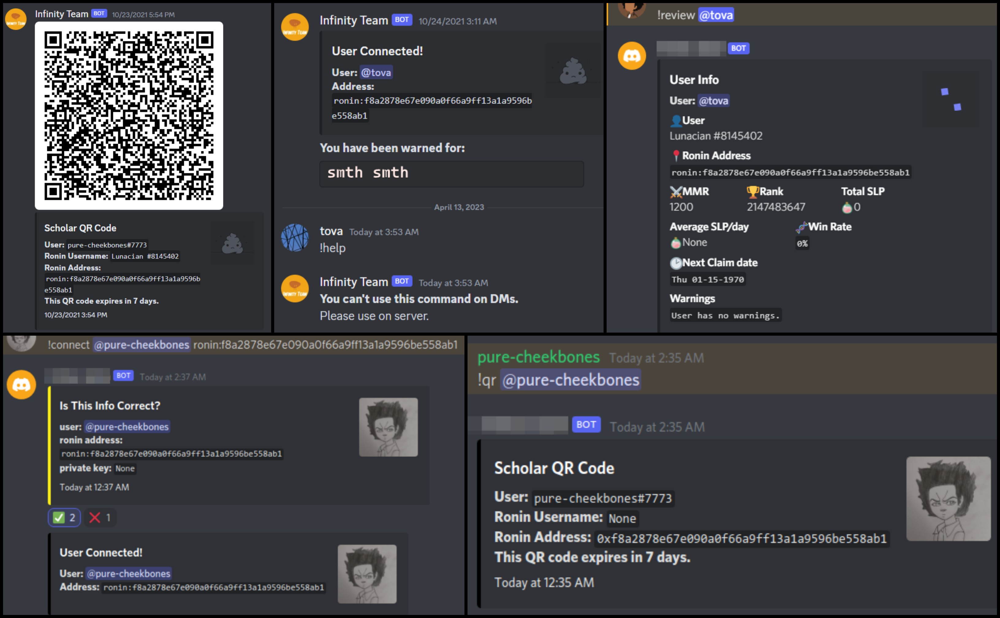

**Infinity Team** is a powerful discord bot built with the [enhanced-dpy](https://github.com/iDutchy/discord.py) library. Designed to streamline your Infinity Team's onboarding process and provide effective tools for managing your team all in one place.

---

## Showcase

You could also check the screenshots folder for more.

---

## Features

check `Usage.md` for more information.

- **Automatic onboarding system** that assigns new members to the `Giants Awaiting Team` role when they enter the server, with you and managers receiving notifications on the `#alerts` channel.
- **QR code integration** for easy connection to the players' axie infinity account using the `!connect @user_mention ronin_wallet` command.
- **A review system** that creates a channel where you can see user stats (including warnings) after QR code expiry. Managers with the role are notified of this in the `#announcements` channel.
- **Moderation commands** such as warn, fire, or approve a user's work. Fired users are placed in a quarantine channel until payment is received, then kicked from the server. On approval, users receive a DM notifying them of it and a new QR code. Warns are added to the database and users get DM'd with them.
- **Additional commands** such as `!gen qr` to generate a new QR code if the automatic process didn't work, `!user_info` to check a user's info anytime, and commands to retrieve users, managers, and other information. And a Help command to assist users in navigating the bot's various features.

---

## How It's Made

- Python with enhanced-dpy library for Discord bot development.
- SQLite for storing users data. Connecting to it using sqlmodel.
- To access the Ronin blockchain, the bot utilizes the web3.py library, which enables interaction with smart contracts and other components of the blockchain.
- It uses the `qrcode` library to generate qr images for the users to connect.

---

## Lessons Learned

1. Gained experience dealing with web3 and the ronin/ethereum block chain.
2. Choosing the right technology stack: Choosing the appropriate technology stack based on the project's requirements like using a small sqlite database as it's a small scale project.
3. Security: Security must be a top priority when developing a chatbot that handles user data or interacts with sensitive systems like blockchain networks.

---

## Installation

To install Infinity Team, follow these steps:

1. Visit the [discord developer portal](https://discord.com/developers/applications) and add a bot there (give it admin privileges).
2. Clone the repository.
3. Install `gcc` using `sudo apt install gcc -y`
4. Install dependencies using `pip install -r requirements.txt`
5. copy `env.template` to `.env` and fill the options
6. Run the bot using `python infinity_team_main.py`.
